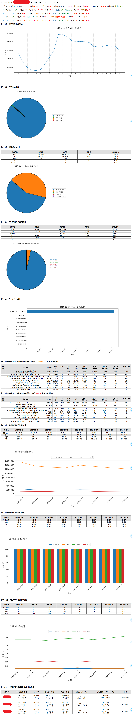

# 部署说明

本文档将详细阐述`nginx_config.json` 配置文件的各字段含义，以及如何测试部署程序。

这里先附上一条nginx访问日志，以下`json`配置将以该格式为例进行说明。

```
[12/Feb/2025:14:47:26 +0800]|User_request_status:200|0.007|23796|36.140.92.228|-|GET|[h.139.com]|/contentimg/202404091546409897945.png|[Mozilla/5.0 (Linux; Android 9; H626 Build/PPR1.180610.011; wv) AppleWebKit/537.36 (KHTML, like Gecko) Version/4.0 Chrome/83.0.4103.106 Mobile Safari/537.36 MCloudApp/11.3.2 AppLanguage/zh-CN]|[gzip, deflate]|[https://h.139.com/content/cloudClass?columnId=55&level=1&channel=140&token=STuid0000011739342839350J3vBto7BzwbHqDToin2nryqyUuKN6b3M&targetSourceId=001005]|36.140.92.228|10.19.57.123:80|Server_status:200|0.007
```


## 1. 配置文件解析

`nginx_config.json` 为程序运行时配置，配置demo：

```json
{
  "service": "业务名称", 
  "base_dir": "nginx日志挂载路径", 
  "nginx_log_format": {
    "log_separator": "|",
    "is_json": false,
    "exclude": {
      "static_extensions": [
        ".jpg",
        ".jpeg",
        ".png",
        ".gif",
        ".mp4",
        ".css",
        ".js"
      ],
      "prefix_filters": [
        "/contentimg/",
        "/assets/"
      ]
    },
    "field_indexes": {
      "ip": 4,
      "timestamp": 0,
      "request_time": 2,
      "method": 6,
      "url": 8,
      "status": 1,
      "bytes": 3,
      "referrer": 11,
      "user_agent": 9,
      "x_forwarded_for": 13
    }
  },
  "time_delay_unit": "s",
  "module_urls": {
    "Module_A": ["/api1","/api/a","/api/b"],
    "Module_B": ["/api2","/api/c","/api/d"],
    "Module_C": ["/api3","/api/e"],
    "Module_D": ["/api4","/api/f"]
  },
  "sender": "engineer891@163.com",
  "smtp_server": "smtp.163.com",
  "recipient": {
    "收件人1": "111@139.com",
    "收件人2": "222@163.com",
    "收件人3": "333@richinfo.cn"
  }
}
```

### 1.1 `service`

- **说明**：表示当前业务的名称。
- **示例**：`"service": "能力开放平台"`

### 1.2 `base_dir`

- **说明**：指定 Nginx 访问日志存放的挂载根目录，该路径为各台nginx主机通过nfs服务远程挂载点目录，该目录下通常包含以各个节点业务ip命名的目录，对应**ip目录**下为nginx业务日志，比如`192.168.3.2`、`192.168.3.3`、`192.168.3.4`三台nginx主机的日志通过nfs挂载到`192.168.3.5`的`/data/nginx/web/`目录，该目录下将会找到类似`/data/nginx/web/192.168.3.2/access.log.2025-02-20`、`/data/nginx/web/192.168.3.3/access.log.2025-02-20`、`/data/nginx/web/192.168.3.3/access.log.2025-02-20`等这样层级关系的文件。
- **示例**：
  ```
  "exclude": {
        "static_extensions": [
          ".jpg",
          ".jpeg",
          ".png",
          ".gif",
          ".mp4",
          ".css",
          ".js"
        ],
        "prefix_filters": [
          "/contentimg/",
          "/assets/"
        ]
      }
  ```

### 1.3 `nginx_log_format`

用于指定 Nginx 访问日志的格式和字段解析。

#### 1.3.1 `log_separator`

- **说明**：定义了日志文件字段的分隔符。根据配置，这里使用了 `|` 作为字段的分隔符。
- **示例**：`"log_separator": "|"`

#### 1.3.2 `is_json`

- **说明**：日志是否是`json`格式数据，如果为`true`，以下`field_indexes`中获取各个字段将不再是索引，而是通过字符串下标获取。
- **示例**：`"is_json": false`

#### 1.3.3 `exclude`

- **说明**：url中需要排除的静态资源文件(比如图片、js、css等)以及特定字符开头的url(比如`/contentimg/`、`/assets/`等)。
- **示例**：`"is_json": false`

#### 1.3.4 `field_indexes`

- **说明**：如果`is_json`为`false`，每行nginx访问日志以`log_separator`字符分隔后，不同字段将对应不同的索引位置，以下定义了日志中的各个重要字段，以及在日志行中的索引位置。字段和索引如下：

  - **`timestamp`**：请求的时间戳，根据以上示例，索引位置为 0，代表第一个字段。
  - **`ip`**：客户端 IP 地址，索引位置为 4，代表第五个字段。
  - **`request_time`**：请求的响应时间，索引位置为 2。
  - **`method`**：请求方法（GET、POST 等），索引位置为 6。
  - **`url`**：请求的 URL，索引位置为 8。
  - **`status`**：HTTP 状态码（如 200、404 等），索引位置为 1。
  - **`bytes`**：返回的字节数，索引位置为 3。
  - **`referrer`**：来源 URL，索引位置为 11。
  - **`user_agent`**：用户代理（浏览器信息等），索引位置为 9。
  - **`x_forwarded_for`**：X-Forwarded-For HTTP 头部信息，索引位置为 13。

- **示例**：(`is_json`为`false`)

  ```json
  "field_indexes": {
    "ip": 4,
    "timestamp": 0,
    "request_time": 2,
    "method": 6,
    "url": 8,
    "status": 1,
    "bytes": 3,
    "referrer": 11,
    "user_agent": 9,
    "x_forwarded_for": 5
  }
  ```
  
- **`json`示例**：(`is_json`为`true`)

  ```json
  "field_indexes": {
    "ip": "remote_addr",
    "timestamp": "time_local",
    "request_time": "request_time",
    "method": "request_method",
    "url": "request_uri",
    "status": "status",
    "bytes": "body_bytes_sent",
    "referrer": "http_referer",
    "user_agent": "http_user_agent",
    "x_forwarded_for": "http_x_forwarded_for"
  }
  ```
  * 如果是`json`格式数据，请根据实际业务字段`key`值来填。

### 1.4 `time_delay_unit`

- **说明**：指定时间延迟的单位，这里一般根据`request_time`字段值的大小可以推测是**秒（s）**还是**毫秒（ms）**，通常为秒（s）或毫秒（ms），具体单位请遵循实际业务。
- **示例**：`"time_delay_unit": "s"`

### 1.5 `module_urls`

- **说明**：定义不同模块的 URL 路径，程序根据这些路径将请求划分为不同的模块。每个模块可以包含多个 URL 路径。*注:* 这里的URL可以为前缀，即可以为前面提到的配置文件中`url`的前缀一部分，不需要完全相等，请遵循实际业务填写。

- **示例**：

  ```json
  "module_urls": {
    "Module_A": ["/api1","/api/a","/api/b"],
    "Module_B": ["/api2","/api/c","/api/d"],
    "Module_C": ["/api3","/api/e"],
    "Module_D": ["/api4","/api/f"]
  }
  ```
  
  * **`Module_A`**：包含了 `/api1`, `/api/a`, `/api/b` 等路径。

  * **`Module_B`**：包含了 `/api2`, `/api/c`, `/api/d` 等路径。

  * 其他模块依此类推。

### 1.6 `sender`

- **说明**：指定发送报告的邮箱地址。
- **示例**：`"sender": "engineer@163.com"`

### 1.7 `smtp_server`

- **说明**：指定 SMTP 邮件服务器地址，用于发送邮件。
- **示例**：`"smtp_server": "smtp.163.com"`

### 1.8 `recipient`

- **说明**：指定收件人的邮箱地址，可以有多个收件人。

- **示例**：

  ```json
  "recipient": {
    "收件人1": "111@139.com",
    "收件人2": "222@163.com",
    "收件人3": "333@richinfo.cn"
  }
  ```


## 2. 如何运行

1. **配置文件**：确保 `nginx_config.json` 配置文件已正确配置（包括日志路径、字段索引位置、SMTP 配置等），并与*simkai.ttf*字体文件、*run*执行文件放同一目录。

2. **运行程序保存邮箱授权码**：确保给`run`程序一个可执行权限:`chmod a+x run`，在命令行中执行可执行文件(*请按照示例加入对应的位置参数*)。

   ```shell
   ./run "发件人邮箱的授权码"
   # 比如: ./run "sda123weqw@abc"
   ```

   **注:** 以上保存邮箱密码只需要运行一次即可，后续更新密码按同样的方式执行一遍即可。

3. **运行程序生成最终报告**：确保给`run`程序一个可执行权限:`chmod a+x run`，在命令行中执行可执行文件(*不加位置参数*)。

   ```shell
   ./run
   ```

4. **加入定时任务**: (参考)

   ```shell
   # 每天8:00点执行一次
   0 8 * * * cd xxx/run && ./run >/dev/null 2>&1
   ```

**备注：**`nginx_config.json`文件务必格式正确，严格遵循`json`格式


### 示例报告

### 